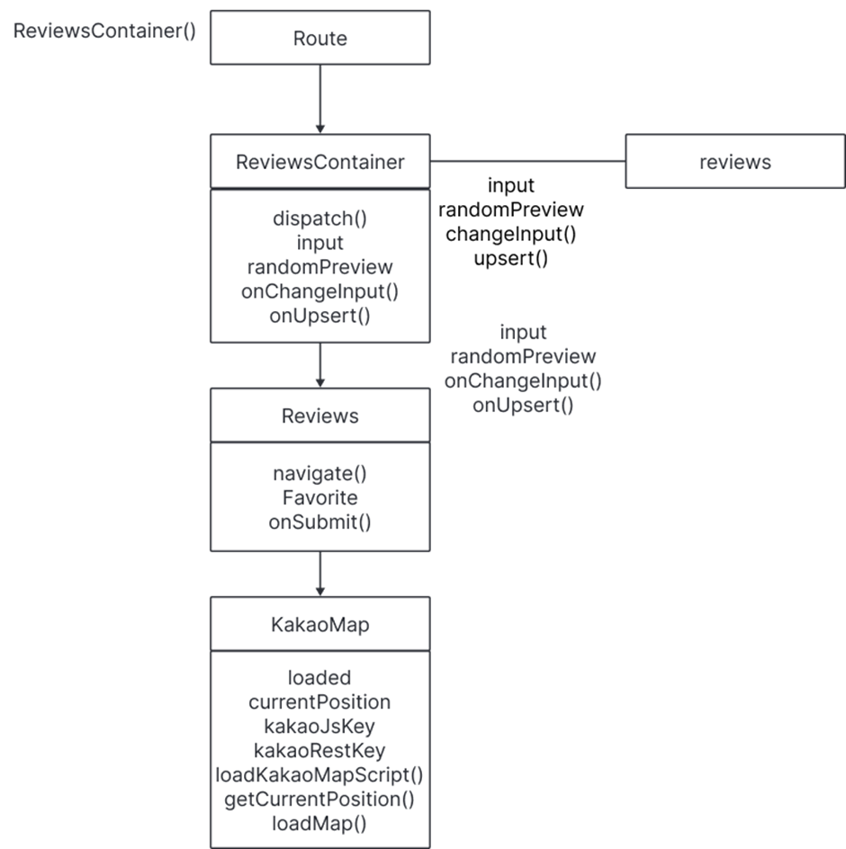

# 기획의도

### 본 프로젝트는 1인 가구를 위한 편의점 조합 레시피 추천 웹 애플리케이션입니다.

최근 1인 가구의 증가와 함께 간편하고 효율적인 식사를 추구하는 수요가 높아지고 있습니다.
하지만 기존의 레시피 서비스들은 대부분 집밥이나 정식 위주의 구성으로,
편의점 식재료를 활용한 레시피를 찾기 어렵다는 한계가 있습니다.
이에 따라 저희는 다음과 같은 기능을 중심으로 프로젝트를 기획했습니다.

- 🎲 **랜덤 조합 추천 기능**  
  다양한 편의점 상품 조합을 **랜덤으로 제안**하여,  
  사용자가 새로운 레시피 조합을 쉽게 발견할 수 있도록 돕습니다.

- 📍 **카카오 API를 활용한 주변 편의점 위치 제공**  
  **카카오 지도 API**를 활용해  
  사용자의 **현재 위치 기반 편의점 정보**를 제공합니다.

- 📝 **게시글 작성 및 좋아요 기능**  
  사용자가 **자신만의 조합 레시피를 등록하고**,  
  다른 사용자와 **좋아요를 통해 소통할 수 있는** 기능을 제공합니다.

이러한 기능들을 통해 1인 가구가 쉽고 재미있게 식사를 해결할 수 있는 플랫폼을 제공하고자 합니다.

## 프로젝트 역할 분담

### 팀장: 🌐 김민식

### 팀원: 🧑‍💻 전하성 | 🎨 윤요엘 |

| 이름       | 역할                                                                    |
| ---------- | ----------------------------------------------------------------------- |
| **전하성** | 더미 데이터 생성 게시판 CRUD 무한 스크롤                          |
| **윤요엘** | 전체 UI/UX 설계 SPA 구성 (Router, Lazy, Suspense) 마이페이지 구현 |
| **김민식** | 외부 API 연동 편의점 위치 안내 화면 구현 (Kakao Map API)             |

# 구현할 핵심기능

### 🔧 개발 구조

- **SPA 구성**: React Router를 이용한 싱글 페이지 애플리케이션 구성
- **Lazy / Suspense 처리**: 페이지별 코드 스플리팅을 통한 성능 최적화
- **반응형 웹**: PC / 모바일 환경 모두 대응

### 💡 상태 관리 및 최적화

- **Redux**: 전역 상태 관리 도입
- **React.memo**: 불필요한 리렌더링 방지를 통한 성능 최적화

### 🔁 기능 구현

- **CRUD**: 게시글 등록, 수정, 삭제, 목록 조회 기능 구현
- **무한 스크롤**: 게시판 리스트의 무한 로딩 처리
- **외부 데이터 연동**: 더미 데이터와 카카오 API를 활용한 실시간 연동

## 사용 라이브러리

### 주요 라이브러리

- **axios** `^1.12.2` – HTTP 비동기 통신 처리
- **classnames** `^2.5.1` – 조건부 클래스 이름 제어
- **react-icons** `^5.5.0` – 다양한 아이콘 사용
- **react-redux** `^9.2.0` – React용 Redux 바인딩
- **redux** `^5.0.1` – 전역 상태 관리
- **redux-devtools-extension** `^2.13.9` – Redux 개발자 도구 지원
- **react-router-dom** `^7.9.4` – SPA 라우팅
- **react-virtualized** `^9.22.6` – 리스트 가상화 (무한스크롤 등)
- **sass** `^1.93.2` – SCSS 스타일링
- **styled-components** `^6.1.19` – CSS-in-JS 스타일링
- **web-vitals** `^2.1.0` – 웹 성능 측정

---

## 🌐 사용 API

- **Kakao Map API** – 사용자의 위치 기반으로 주변 편의점 위치를 시각화함

# Flow와 UI 기능동작

# Home

## UI PC

## UI 모바일

# Redux

# Reviews

