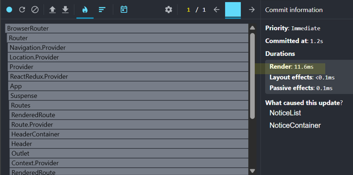

# 🎯기획의도

### 본 프로젝트는 1인 가구를 위한 편의점 조합 레시피 추천 웹 애플리케이션입니다.

최근 1인 가구의 증가와 함께 간편하고 효율적인 식사를 추구하는 수요가 높아지고 있습니다.
하지만 기존의 레시피 서비스들은 대부분 집밥이나 정식 위주의 구성으로,
편의점 식재료를 활용한 레시피를 찾기 어렵다는 한계가 있습니다.
이에 따라 저희는 다음과 같은 기능을 중심으로 프로젝트를 기획했습니다.

- 🎲 **랜덤 조합 추천 기능**  
  다양한 편의점 상품 조합을 **랜덤으로 제안**하여,  
  사용자가 새로운 레시피 조합을 쉽게 발견할 수 있도록 돕습니다.

- 📍 **주변 편의점 위치 제공**  
  사용자의 **현재 위치 기반 편의점 정보**를 제공합니다.

- 📝 **게시글 작성 및 좋아요 기능**  
  사용자가 **자신만의 조합 레시피를 등록하고**,  
  다른 사용자와 **좋아요를 통해 소통할 수 있는** 기능을 제공합니다.

이러한 기능들을 통해 1인 가구가 쉽고 재미있게 식사를 해결할 수 있는 플랫폼을 제공하고자 합니다.

---

   

# 👥프로젝트 역할 분담 & 작업일지

### Team | 🌐 김민식 | 🧑‍💻 전하성 | 🎨 윤요엘 |

| 이름      | 역할 요약                                | 작업 링크                                                                                 |
| --------- | ---------------------------------------- | ----------------------------------------------------------------------------------------- |
| 🧑‍💻 김민식 | 외부 API 연동, 편의점 위치 안내 구현     | [작업일지](https://www.notion.so/292fc6992fc580868fbfdaba3414ec34)                        |
| 👨‍🎨 윤요엘 | UI/UX 설계, SPA 구성, 마이페이지 구현    | [작업일지](https://www.notion.so/react-29258bd0f61d801b80c5efac6a6f71fe?source=copy_link) |
| 👨‍🔧 전하성 | 게시판 구현, 더미데이터 생성, 무한스크롤 | [작업일지](https://www.notion.so/REACT-29279e171ce18013a933d8c1f12dbc27?source=copy_link) |

---

   

# 📦사용한 라이브러리와 API

### Library

- **axios** `^1.12.2` – HTTP 비동기 통신 처리
- **classnames** `^2.5.1` – 조건부 클래스 이름 제어
- **react-icons** `^5.5.0` – 다양한 아이콘 사용
- **react-redux** `^9.2.0` – React용 Redux 바인딩
- **redux** `^5.0.1` – 전역 상태 관리
- **redux-devtools-extension** `^2.13.9` – Redux 개발자 도구 지원
- **react-router-dom** `^7.9.4` – SPA 라우팅
- **react-virtualized** `^9.22.6` – 리스트 가상화 (무한스크롤 등)
- **sass** `^1.93.2` – SCSS 스타일링
- **styled-components** `^6.1.19` – CSS-in-JS 스타일링
- **web-vitals** `^2.1.0` – 웹 성능 측정

### API

#### **Kakao Map API** 사용자의 위치 기반으로 주변 편의점 위치를 시각화

---

   

# ⚙️구현된 핵심기능

### 🔧 개발 구조

- **SPA 구성**: React Router를 이용한 싱글 페이지 애플리케이션 구성
- **반응형 웹**: PC / 모바일 환경 모두 대응

### 🔁 기능 구현

- **CRUD**: 게시글 등록, 수정, 삭제, 목록 조회 기능 구현
- **무한 스크롤**: 게시판 리스트의 무한 로딩 처리
- **외부 데이터 연동**: 더미 데이터와 카카오 API를 활용한 실시간 연동

### 💡 상태 관리

- **Redux**: 전역 상태 관리 도입

### 🚀 성능최적화

- **React.memo**: 불필요한 리렌더링 방지를 통한 성능 최적화
- **Lazy / Suspense 처리**: 필요할 때만 컴포넌트를 로딩하여 초기 로딩 속도
  개선
- **useCallback** : 컨테이너 컴포넌트의 dispatch 함수에 useCallback을 적용해 렌더링 최적화
- **Infinite Scroll** : react-virtualized의 **AutoSizer**와 **List**를 활용해, 많은 양의 게시글도 부드럽고 효율적으로 렌더링되도록 최적화

### 🚀 최적화 성능비교

---

### 1.최적화 전 렌더링 시간

게시판(Notice)기준에서 측정하였습니다.

### Render 272ms

---

### 2.최적화 (React.memo / useCallback)

React.memo와 useCallback을 함께 사용하여, 불필요한 컴포넌트 리렌더링을 방지하고 렌더링 성능을 최적화했습니다.

### Render 11.6ms

---

### 3.최적화 무한스크롤 + React.memo / useCallback

무한스크롤과 리스트 가상화를 함께 적용해,
데이터를 점진적으로 불러오면서도 보이는 항목만 렌더링하여
성능을 효율적으로 최적화했습니다.

### Render 2.6ms

### 결과 Render 272ms -> 2.6ms 104배 렌더링 속도 개선을 이루어

#### 사용자 경험의 체감 성능을 **비약적으로 개선**했습니다.

---

   

# 🧬프로젝트 Flow와 UI

## 1. 메인페이지(Home)

### 주요기능 : 랜덤으로 라면과 들어갈 토핑을 추천받는다.

| 🍜 라면(랜덤) | ➕ 토핑(랜덤) 1 ~ 3

## Flow

### 💻 PC 화면 (반응형 UI)

### 📱 모바일 화면 (반응형 UI)

---

   

## 2. Redux 상태 관리 흐름

### 전역상태로 관리

> 🍜 리뷰 데이터,
>
> - 입력된 리뷰 리스트 (텍스트, 라면 + 토핑 조합 포함)
> - 좋아요(하트) 상태 토글
> - 새로운 리뷰 등록 및 기존 리뷰 수정 기능 포함
>     

> 🌀 랜덤 데이터
>
> - 라면 1종 + 토핑 1~3종 조합
> - `getRandomMenu()`로 생성, 전역 상태에 저장됨

Redux를 통해 컴포넌트 간 상태 공유가 쉬워지고,
복잡한 데이터 흐름도 일관성 있게 관리할 수 있도록 구성했습니다.

#### Redux Flow

---

### 💻 보기(GIF)

---

   

## 3. 후기작성 & 근처 편의점 찾기 (Kakao Map API)

### 주요기능

> - 후기작성, 게시판 등록
> - 좋아요를 눌러서 조합저장
> - 새로운 리뷰 등록 및 기존 리뷰 수정 기능 포함

> - **KAKAO MAP API 활용하여 근처 편의점 찾기**

## Flow

### 💻 PC 화면 (반응형 UI)(GIF)

### 📱 모바일 화면 (반응형 UI)

---

   

## 4. 게시판

> ### 주요기능
>
> - 글을 작성 등록 할 수 있습니다.
> - 좋아요를 눌러 마이페이지에 저장 할 수 있습니다.

## Flow

### 💻 PC 화면 (반응형 UI)(GIF)

### 📱 모바일 화면 (반응형 UI)

---

   

## 5. 마이페이지

> ### 주요기능
>
> - 사용자가 작성한 게시글을 모아보고 관리할 수 있는 공간입니다.

## Flow

### 💻 PC 화면 (반응형 UI)(GIF)

### 📱 모바일 화면 (반응형 UI)

---

# END

이 프로젝트는 도전적인 아이디어에서 출발해, 단순하면서도 시대의 흐름에 맞는 콘셉트를 담았습니다.
기술적으로는 사용자 경험을 고려한 편의점 라면 조합 추천 및 리뷰 기능을 중심으로 구성되었으며, Redux 기반의 전역 상태 관리를 통해 유지 보수성과 확장성을 강화했습니다.
   
"작은 것이 모여 큰 변화를 만든다."
   

### Made by

🌐 김민식 &nbsp;&nbsp;|&nbsp;&nbsp; 🧑‍💻 전하성 &nbsp;&nbsp;|&nbsp;&nbsp; 🎨 윤요엘

   
